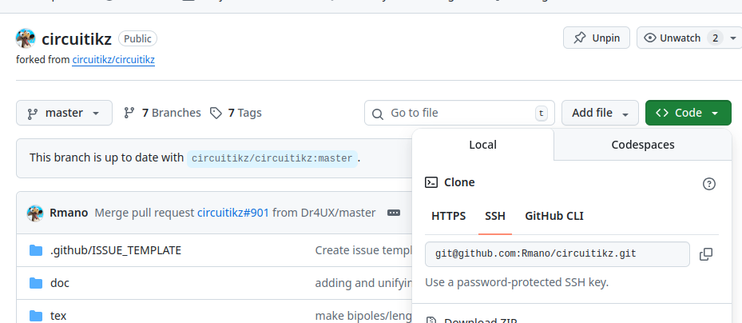
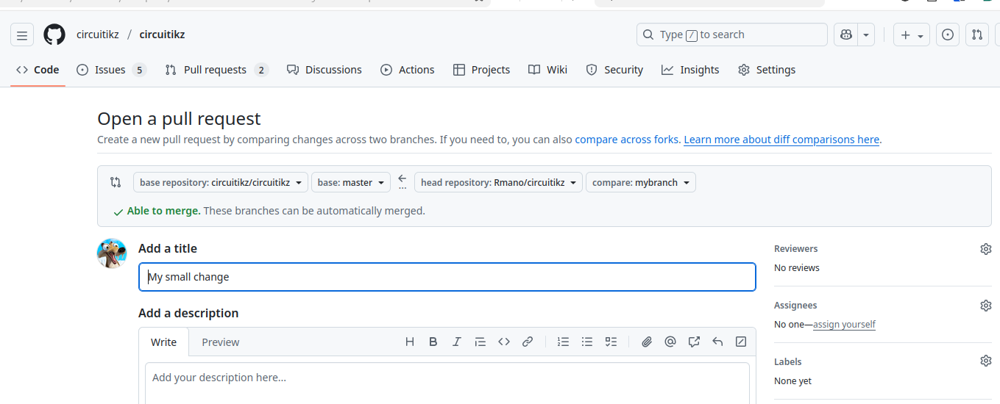

# Contributing

When contributing to this repository, please first discuss the change you wish to make via issue,
email, or any other method with the owners of this repository before making a change. 

Although this project has no official Code of Conduct, we ask you to be kind, and respectful in your comments and request. 
Remember that this is an effort from a group of volunteers, so be patient... 

# Preferred way of contributing

If you'd like to contribute changes, enhancement an bug-fixes, you are welcome to do so! The preferred way is a pull request (see https://help.github.com/articles/about-pull-requests/), which is the best way to preserve authorship (see appendix 2) . 

The pull request should:

* be based on the `master` branch of the `circuitikz` repository;
* have a text explaining the content of the request clearly;
* be specific: please avoid a big pull request touching a lot of different places and with a lot of different objectives; that would make the history unclear; 
* if the pull request is an enhancement, it should add the correspondent info to the manual (`circuitikzmanual.tex` in the `doc` directory); please check that it compiles correctly against your changes (see appendix 1).

# Other way of contributing

Just open an issue. We will try to help you the best we can. 

# Troubleshooting 

Again, just open an issue. But another way of finding answer is to ask a [good question](https://tex.meta.stackexchange.com/questions/1436/welcome-to-tex-sx) on [TeX-LaTeX stack exchange](https://tex.stackexchange.com/questions) using the `circuitikz` tag. 

## Appendix 1: compile the manual

To compile your manual against your version/fork of `circuitikz` you can use `make manual` in the root directory; this needs `pandoc` to be installed, and will run twice in order to completely generate the document cross-references. 

To rapidly compile just once, to check you have not introduced any error, at least in Linux computers, you can use

    make test-compile

...please adapt it for your OS. 

## Appendix 2: minimal git workflow 

The best way to start learning GIT is reading [Pro GIT](https://git-scm.com/book/en/v2), a really nice book about it. 

But basically, a possible workflow is (notice that you have to go through point 1 only once!) is described here. The example is based on a Linux system, but it should be easy to adapt to any operating system with a decent command line terminal and with `git` and `ssh` installed. 

**Point 1:** *You do that just once!* :fork the repo in your GitHub account and clone it locally.

For the following example commands, I have forked the main `circuitikz` repository, https://github.com/circuitikz/circuitikz, to my personal one, https://github.com/Rmano/circuitikz. If you do the same, you  will have full write access to your fork, but just read access to the main one.

Now you have to clone your fork to your computer. Under the "<> Code" button you'll find various ways of cloning it (I use ssh; you can use https instead, but [setting up a ssh key](https://docs.github.com/en/authentication/connecting-to-github-with-ssh/about-ssh) will simplify things later).

  

So I go to a directory of my choice, for example `~/software/myforks/` and clone it.

```
cd ~/sofware/myforks
git clone git@github.com:Rmano/circuitikz.git

```
Now I have my local, personal copy of `circuitikz` in my computer, in the folder `~/software/myforks/circuitikz`. Let tell it this copy where the upstream version is, to simplify keeping it in sync (this step is optional, you can do it via the interface on GitHub, but I think it's easier to have it available in the local repository.

Go to the clone and setup the upstream reference:

```
git remote add upstream git@github.com:circuitikz/circuitikz.git
```
Notice that the "link" here is the same as the clone target; so if you are using https, you probably need something like `git remote add upstream  https://github.com/circuitikz/circuitikz.git`. Adapt to your case!

**Point 2:** *Keep it in sync.* Now suppose that while you are waiting to write your contribution, the (evil) maintainer of the main repository has added things. `git` is able to solve a lot of conflicts caused by that, but it could happen that the maintainer not so much. It is better to keep the repo synced and to always work "against" the current code. To keep your repo synced with the "upstream" one, you just do

```
git checkout master
git fetch upstream
```
You will have a summary of the new objects retrieved (the first time it will be quite a long thing...); you have to merge them into your tree now:

```
git merge upstream/master
```

If there have been no changes, you'll have a nice `Already up to date` message. Otherwise, your local `master` branch will be synchronized with upstream, hopefully without problems.

If you have conflicts here you need to solve them. Clearly, the maintainer of the upstream `circuitikz` can also solve them, but I bet they'll prefer to receive *clean* PRs...

**Point 3:** *Contribute*

So you want to propose adding something or change something in `circuitikz`, and you want to propose the change (that is what a "PR" is) to the upstream maintainer(s). The first thing you do is create a branch in your repository: 

    git checkout -b mybranch
    
and now you do your changes. Edit all the files you need to edit, check that things still work ok (see the Appendix 1 above!), commit them to your branch (yes, you need to grok a bit of git to continue). 

Suppose that the (even more evil) maintainer upstream commit a change before you finish. The best thing you can do to simplify the maintainer's life is to resync your master (steps in point 2 above), and then *rebase* your changes:

```
git checkout -b branch; git rebase master
```
...and solve any conflicts that could arise (again, it's you or the maintainer).  After you are done, check the checklist in "Preferred way of contributing" above, clean up your commit, and proceed. Do not forget to add your attribution to the changelog and where you want in the manual.

You can check your changes with `git diff`:

```
git diff master..
```
which will, for example, print:

```diff
diff --git a/CHANGELOG.md b/CHANGELOG.md
index ebd53e5..2e11ae9 100644
--- a/CHANGELOG.md
+++ b/CHANGELOG.md
@@ -1,7 +1,7 @@
 <!--- CircuiTikz - Changelog --->
 The major changes among the different CircuiTikZ versions are listed here. See <https://github.com/circuitikz/circuitikz/commits> for a full list of changes.
 
-* Version 1.8.4 (unreleased)
+* Version 1.8.4 (unreleased with a change)
 
     The main highlights of this release is a new appearance (optional!)
```
**Point 4:** *Create the PR* 

The first step is to push it on your repo; that will make it publicly available:

```
git push -u origin mybranch
```

And you will have, for example:

```
Enumerating objects: 5, done.
Counting objects: 100% (5/5), done.
Delta compression using up to 8 threads
Compressing objects: 100% (3/3), done.
Writing objects: 100% (3/3), 317 bytes | 317.00 KiB/s, done.
Total 3 (delta 2), reused 0 (delta 0), pack-reused 0
remote: Resolving deltas: 100% (2/2), completed with 2 local objects.
remote: 
remote: Create a pull request for 'mybranch' on GitHub by visiting:
remote:      https://github.com/Rmano/circuitikz/pull/new/mybranch
remote: 
To github.com:Rmano/circuitikz.git
 * [new branch]      mybranch -> mybranch
branch 'mybranch' set up to track 'origin/mybranch'
```
As suggested, you can now go to the GitHub page and do the PR, or continue working. Notice that if you make more changes, and then commit them and push them, they will be automatically added to your publicly available branch and to the PR. 

In the GitHub interface you'll have this:

  

If you look the first row in the grey box, GitHub explains that you want to "send" your code (branch `mybranch`  of `Rmano/circuitikz` repository) to the master branch of the main one. Correct!

Fill the title, add the info that you think is relevant, and create the PR. The maintainer will be informed and will be able to act on it: accept, ask for changes (that you can do and then commit and push on your branch, and it will be updated automatically), or (sometimes it happens) reject it. 

**Point 5:** *Cleanup*

After/if the PR is accepted, *optionally* tidy up removing branches (or you can preserve them, whatever you like)

```        
git branch -d mybranch
git push --delete origin mybranch
```

It is very important, after the PR is accepted, that you repeat the synchronization of point 2, so that you have everything tidied up for your next PR.

